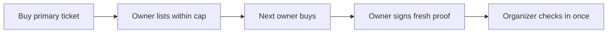

# FairTicket


**Event tickets with resale rules enforced by the contract.**

FairTicket is a Monad testnet prototype for buying tickets, reselling them within a configured markup, and checking in with proof from the current owner's wallet. It explores how much of a ticketing policy can be enforced on-chain.

[Project deployment](https://fairticket-monad.sujeethsai265.chatgpt.site/) · [Smart contract](contracts/contracts/FairTicket.sol) · [Contract tests](contracts/test/FairTicket.ts) · [Contract setup](contracts/README.md)

Built by **Team Rockerz** for **Monad Blitz Hyderabad V3**.

## What makes it interesting

| Rule | Implementation |
| --- | --- |
| Exact-price primary sale | `buyPrimary` checks payment, supply, and purchase limits. |
| Controlled resale | Ordinary ERC-721 transfers and approvals are disabled; ownership changes through the marketplace. |
| Per-owner price cap | `maxResalePrice` calculates the next allowed price from the current owner's acquisition price. |
| Wallet-proven entry | The organizer checks in an attendee using a fresh signature from the current owner. |
| Replay resistance | Challenges include the contract, chain, ticket, deadline, owner, and ownership nonce; used tickets cannot check in again. |
| Separate proceeds | Sellers and the organizer withdraw their recorded proceeds. |

For a ticket acquired at **0.01 MON** with a **10%** markup, the next permitted price is **0.011 MON**. The cap follows the current owner's purchase price, so repeated resales can compound; this implementation is not a permanent cap relative to the original face value.



## Run the web app

Requires **Node.js 22.13+**, npm, and an EVM wallet for transaction flows.

```bash
git clone https://github.com/Sujeeth-Sai/Fair-Ticket-Monad.git
cd Fair-Ticket-Monad
npm ci
npm run dev
```

Open [localhost:3000](http://localhost:3000). [`lib/fair-ticket.ts`](lib/fair-ticket.ts) contains the ABI, Monad testnet configuration, and default contract address. `NEXT_PUBLIC_FAIR_TICKET_ADDRESS` can override the address; the app also accepts a `contract` query parameter.

A custom deployment needs its own reviewed contract address and event parameters. Use testnet funds only. The repository's deployment reference is not a promise that a past demo event still has tickets available.

## Compile and test the contract

The contracts use **Hardhat 3**, Solidity, and OpenZeppelin.

```bash
cd contracts
npm ci
npm run compile
npm test
```

[Deployment instructions](contracts/README.md) describe the Hardhat Ignition flow and local keystore setup.

## A five-minute walkthrough

1. Inspect the event rules and connect a buyer wallet on Monad testnet.
2. Buy a primary ticket at the exact price.
3. Attempt a listing above the allowed cap, then list within it.
4. Buy the listing from a second wallet.
5. Sign a check-in proof with the current owner; submit it through the organizer flow.
6. Try the proof again and confirm that a used ticket cannot enter twice.

## Where to look in the code

- [`contracts/contracts/FairTicket.sol`](contracts/contracts/FairTicket.sol): purchase, resale, proof validation, and proceeds.
- [`contracts/test/FairTicket.ts`](contracts/test/FairTicket.ts): payment and purchase limits, transfer restrictions, resale, signatures, stale proofs, and withdrawals.
- [`app/page.tsx`](app/page.tsx): buyer, marketplace, ticket, and gate interface.
- [`app/api/rpc/route.ts`](app/api/rpc/route.ts): browser RPC proxy.
- [`app/api/metadata/[tokenId]/route.ts`](app/api/metadata/%5BtokenId%5D/route.ts): ticket metadata.

The web app uses React, TypeScript, Vinext/Vite, and viem. Its checks are `npm run lint` and `npm test` from the repository root; the latter builds the site and runs rendered-HTML tests. Contract tests are a separate suite under `contracts/`.

## Current limits

This is a hackathon prototype, not an independently audited ticketing service. Resale caps do not prevent off-platform payments, wallet sales, or multi-wallet buying. The organizer holds privileged pause, metadata, and gate powers. Production use would need refund/cancellation handling, role separation, monitoring, and an independent audit.

## Contributing

Useful next work: invariant and fuzz tests for ownership changes, clearer cap semantics, separated gate roles, and reproducible wallet-flow tests. Include the network, reproduction steps, and transaction hash when reporting a testnet issue.
